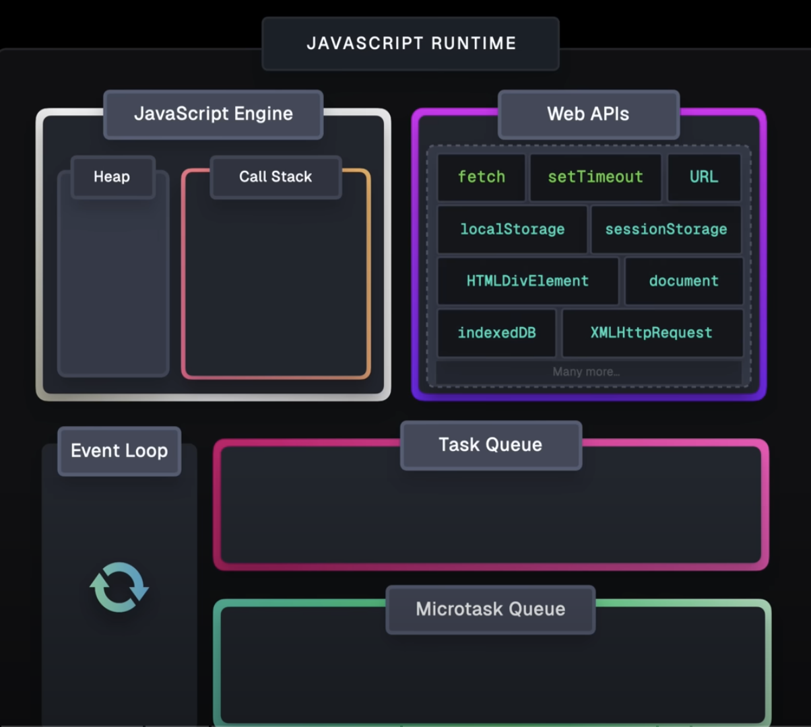
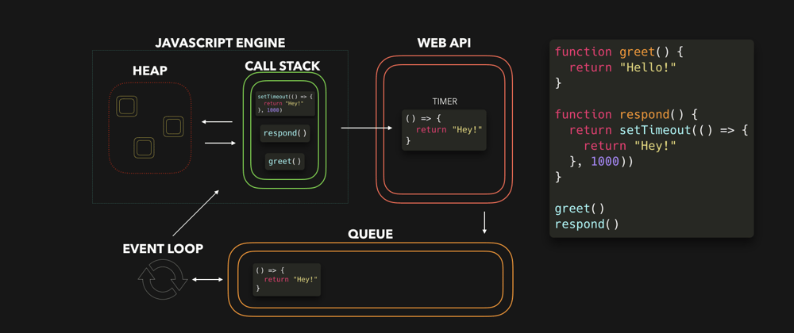

### 📍비동기 처리 작동방식 - 이벤트루프, 태스트큐📍


사진 : [https://www.lydiahallie.com/blog/event-loop](https://www.lydiahallie.com/blog/event-loop)

 

## ✅ 동기,비동기 차이
**동기 처리**

자바스크립트는 “싱글 스레드” 방식이기 때문에, 한번에 하나의 작업만 처리할 수 있다.
이렇게 하나의 작업이 끝날 때까지 다른 작업이 대기하는 방식이 동기 처리이다.

**비동기 처리**

하지만 현재 실행 중인 작업이 완료되지 않았더라도, 다음 작업을 곧바로 실행할 수 있다. 이것이 비동기처리.
요청을 보낸 후 응답 여부와 상관없이 다음 태스크를 병렬적으로 수행할 수 있는 방식이다.

이런 비동기 처리는 브라우저에서 실행되는 1)이벤트 루프와 2)태스크 큐를 통해 가능한 것임.

- 브라우저에서 백그라운드로 비동기 처리가 이뤄지기 때문에, 콜 스택을 차단하지 않는 것임.<br/>
→ 이를 통해 싱글 스레드에서, 비동기 작업을 처리할 수 있는 것임.


<br/>

## ✅ setTimeout 예제를 통한 비동기 처리 ⭐️
    


1. 자바스크립트 엔진 구성 : Heap과 Call Stack

    **Heap**
    - 동적으로 생성된 객체들이 저장되는 메모리 영역
    - Call Stack에서 실행 중인 함수가 필요한 객체를 이곳에서 참조합니다.

    **Call Stack(실행 컨텍스트 스택)**

    - 함수 호출과 실행 컨텍스트가 쌓이고 제거되는 곳.
    - 함수가 실행될 때 Call Stack에 쌓이고, 실행이 완료되면 Call Stack에서 제거된다.
    - 자바스크립트는 싱글 스레드로 동작하므로 Call Stack에서 한 번에 하나의 작업만 실행됩니다.

<br/>

**2. Call Stack에서 함수 실행**

```jsx
console.log("Start"); // (1)

function foo(){
    console.log("This is delayed"); 
}

    // (2) setTimeout함수 실행
setTimeout(() => {foo , 1000); // (4) 비동기 작업 : 콜백함수 foo는 web api로 위임되고

console.log("End"); // (2)1000ms 후에 실행되는 비동기 작업을 기다리지 않고, 다음 작업을 바로 실행한다.
```

**실행 흐름**:

1. `console.log("Start")` 실행 → Call Stack에 쌓였다가 실행 후 제거됩니다.
2. `setTimeout` 호출 → Call Stack에 들어오지만, 브라우저의 **Web API**로 작업이 위임됩니다.
이후 `setTimeout` 함수는 Call Stack에서  바로 제거됩니다.
1. `console.log("End")` 실행 → Call Stack에 쌓였다가 실행 후 제거됩니다.
2. Web API에서 대기 중이던 `setTimeout` 콜백 함수(`foo`)가 **1초 뒤에 태스크 큐로 이동**합니다.

<br/>

**3. Web API로 비동기 작업 위임**

- setTimeout 함수 실행
    - setTimeout 함수는 브라우저의 Timer Web API에게 대기 시간을 설정한 뒤, 전달받은 foo콜백함수를 위임한다.
    - 위임 후 setTimeout함수는 실행이 끝나서 바로 콜스택에서 제거된다
    - 이후 타이머~ foo콜백함수 태스크 큐에 등록 ←이 과정은 브라우저의 web api가 처리하는 것임.
- 브라우저의 Web API가 타이머 설정
    - 브라우저는 설정된 1000ms(1초) 타이머가 만료될 때까지 대기한다.
    - 이후 브라우저의 Timer Web API는 1초동안 타이머를 작동시킨 뒤, 
    1초 뒤에 foo를 바로 실행하지 않고, foo콜백함수를 태스크 큐로 보낸다.

<br/>

**4.태스트 큐에 작업 추가**
- 태스크 큐(Task Queue)는 비동기 작업이 완료된 후 실행 대기 중인 **콜백 함수들이 저장되는 대기열**입니다.

타이머가 완료되면, setTimeout 콜백 함수 foo 는 태스크 큐로 이동한다.

태스크 큐 는 두가지로 나뉜다. 

- 마이크로 태스크 큐: `Promise`와 같은 더 높은 우선순위의 비동기 작업을 처리 ← 우선순위 높음
- 매크로 태스크 큐: 그 외 setTimeout과 같은 일반적인 비동기 작업을 처리

<br/>

**5. Event Loop (이벤트 루프)**

이벤트 루프는 Call Stack이 비어 있는지 확인한다.

Call Stack이 비어 있으면, Queue에 있는 작업을 Call Stack으로 가져와 실행하게 된다.

<br/>

**6. 최종 콜백 함수 실행**

이벤트 루프에 의해 setTimeout의 콜백 함수 foo가 Call Stack으로 이동해 실행된다.

---

<br/>


## ✅ fetch 예제를 통한 비동기 처리 ⭐️
    
```js
console.log('Start'); // (1)

fetch('https://jsonplaceholder.typicode.com/posts/1') // (2)
    .then((response) => {
        console.log('Response received'); // (4)
        return response.json(); // 파싱 결과 반환
    })
    .then((data) => {
        console.log('Data:', data); // (5)
    })
    .catch((error) => {
        console.error('Error:', error); // 에러 처리
    });

console.log('End'); // (3)
```
 

### **코드 실행 과정**

1. **Start 출력**:
    - 동기 코드이므로, 바로 실행되고 `Start`가 출력됩니다.
2. **`fetch` 호출**:
    - `fetch`가 호출되면, HTTP 요청을 브라우저의 Web API(예: `XMLHttpRequest` 또는 `fetch`의 내부 구현)로 위임되서 처리하게 됩니다.
    - `fetch` 함수는 브라우저의 Web API에 HTTP 요청을 보낸 뒤, 요청이 완료될 때까지 대기하지 않고 바로 실행을 종료하고 콜 스택에서 제거됩니다.
        - 이후 http응답~태스크 큐에 콜백함수 등록 ← 이 과정은 다 web api를 통해 처리되는 것임.
        - `fetch`가 보낸 HTTP 요청은  브라우저의 Web API에서 처리됩니다. fetch함수는 **비동기 작업**이므로, 이 과정은 비동기적으로 이루어지며, 서버로부터 응답을 받는 동안 **JS 코드의 실행은 계속됩니다**.
        
        (그 후, HTTP 요청의 응답이 도착하면 **콜백 함수(`then`/`catch`)가 태스크 큐에 등록**되고, 
        이벤트 루프에 의해 **콜백 함수가 콜 스택으로 옮겨져 실행**됩니다. 
        따라서 `fetch`가 종료된 후 응답을 받는 과정은 **비동기적**이며, `fetch` 호출 자체는 즉시 종료됩니다.)
        
3. **End 출력**:
    - `fetch`의 실행이 끝난 뒤, 동기 코드인 `console.log('End')`가 실행되어 `End`가 출력됩니다.
4. **서버로 부터 HTTP 요청 응답 도착**:
    - 브라우저가 서버로부터 응답을 받습니다.  
    web api가  `then`에서 지정한 첫 번째 콜백 함수가 **태스크 큐**에 추가됩니다.
    - http응답은 브라우저의 web api가 then의 콜백함수로 전달하는 것임.
5. **이벤트 루프 확인**:
    - 콜 스택이 비어 있는지 이벤트 루프가 확인합니다.
    - 동기 코드 실행이 모두 끝났으므로, **태스크 큐**에서 첫 번째 `then`의 콜백 함수가 콜 스택으로 이동합니다.
6. **첫 번째 `then` 콜백 실행**:
    - `console.log('Response received')`가 실행되어 `Response received`가 출력됩니다.
    - `response.json()`이 호출되고, 다시 비동기적으로 JSON 데이터를 파싱합니다.
7. **JSON 파싱 완료 후**:
    - JSON 데이터가 파싱된 뒤, 두 번째 `then` 콜백 함수가 태스크 큐에 등록됩니다.
8. **이벤트 루프 반복**:
    - 콜 스택이 비어 있으면, 태스크 큐에서 두 번째 `then` 콜백 함수가 콜 스택으로 이동합니다.
    - `console.log('Data:', data)`가 실행되어 파싱된 데이터를 출력합니다.

 
### **태스크 큐의 역할**

1. **`fetch` 응답 처리**:
    - 서버에서 응답이 도착하면, `then`에 정의된 **콜백 함수**들이 순차적으로 태스크 큐에 추가됩니다.
2. **JSON 파싱 결과 처리**:
    - `response.json()`의 파싱이 완료된 후, 그 결과를 처리하는 콜백 함수도 태스크 큐에 추가됩니다.
 

<details>
<summary> ※ web api가 뭔지? - gpt</summary>
<div markdown="1">  
    
**Web API**란 웹 브라우저 환경에서 제공하는 API로, 비동기 작업을 처리할 수 있게 해주는 기능을 제공한다. JavaScript에서는 주로 **비동기 작업**을 처리하는데 사용되고, 이들 API는 **JavaScript 코드의 실행을 차단하지 않고 백그라운드에서 작업을 처리**할 수 있도록 도와줍니다.
 

### **Web API란 무엇인가?**

Web API는 브라우저가 제공하는 **기능 집합**으로, 비동기 요청을 수행하거나 타이머, 이벤트 처리 등을 할 수 있게 해줍니다. 예를 들어, **AJAX 요청**, **타이머**, **파일 읽기** 등이 이에 해당합니다.

### **Web API의 주요 예시**

1. **`setTimeout` / `setInterval`**
    - 특정 시간이 지나고 콜백 함수를 실행할 수 있는 기능을 제공.
    - 비동기적으로 **타이머** 작업을 처리합니다.
    - setTimeout 자체가 Web API인 것은 아님!
    setTimeout을 호출하면 브라우저의 Web API가 내부적으로 타이머를 관리하고 그 후에 콜백 함수를 실행하는 방식이다.
        1. **`setTimeout` 호출**: JavaScript 코드에서 `setTimeout`을 호출합니다.
        2. **Web API 타이머 설정**: 브라우저의 Web API가 타이머를 설정하고, 설정된 시간이 지나면 **콜백 함수를 태스크 큐에 넣습니다**.
        3. **이벤트 루프**: 이벤트 루프가 태스크 큐에서 대기 중인 콜백 함수를 **콜 스택으로 옮겨 실행**합니다.
        
        ```jsx
        setTimeout(() => {
            console.log("1초 후 실행");
        }, 1000);
        ```
        
2. **`fetch` / `XMLHttpRequest`**
    - 서버와의 **비동기 HTTP 요청**을 처리하는 API.
    - 서버로부터 데이터를 요청하고, 응답을 받은 후 콜백 함수를 실행합니다.
    - `fetch`자체가 Web API인게 아님
    : `fetch`는 Web API에 HTTP 요청을 보내는 **함수**이고, 
        실제 http 요청과 응답은 **브라우저의 Web API가 담당**합니다.
        - fetch를 호출하면, 실제 HTTP 요청은 Web API가 담당합니다.
        예를 들어, 브라우저의 `XMLHttpRequest`나 **`fetch` 내부의 Web API**가 요청을 보냅니다.
    
    ```jsx
    fetch('/api/data')
        .then(response => response.json())
        .then(data => console.log(data));
    ```
    
3. **`Promise`**:
    - 비동기 작업의 결과를 다루는 객체로, `then`과 `catch` 메서드를 사용하여 결과나 오류를 처리할 수 있게 합니다.
    
    ```jsx
    let promise = new Promise((resolve, reject) => {
        setTimeout(() => resolve("작업 완료"), 2000);
    });
    
    promise.then(result => console.log(result));
    ```
    
4. **`localStorage` / `sessionStorage`**:
    - 웹 브라우저에서 데이터를 **로컬 저장소에 비동기적으로 저장**하고 **가져오는 작업**을 처리하는 API
5. **`WebSocket`**:
    - 서버와 클라이언트 간의 **실시간 양방향 통신**을 위한 API입니다.
    - **비동기적으로** 메시지를 주고받을 수 있습니다.ㄴ

### **Web API의 역할**

Web API는 JavaScript 코드가 **동기적으로 실행되던 흐름을 차단하지 않고**, 백그라운드에서 작업을 수행할 수 있게 해줍니다. 예를 들어, **AJAX 요청**은 서버에 데이터를 요청하고, 서버에서 응답을 받으면 그 응답을 처리하는 콜백 함수를 실행합니다. 이때 요청은 **비동기적으로** 이루어지므로, 서버 응답을 기다리는 동안 다른 코드들이 실행됩니다.

### **실제 예시: `fetch`와 `setTimeout`**

```jsx

console.log("Start");

setTimeout(() => {
    console.log("Timeout 실행");
}, 1000);

fetch('https://jsonplaceholder.typicode.com/posts')
    .then(response => response.json())
    .then(data => console.log(data));

console.log("End");

```

### **실행 순서**

1. `"Start"`가 출력됩니다.
2. `setTimeout` 함수가 호출되어 **1초 후** 콜백이 실행됩니다.
3. `fetch` 요청이 보내지고, 서버의 응답을 기다리는 동안 **동기 코드**는 계속 실행됩니다.
4. `"End"`가 출력됩니다.
5. 서버로부터 응답이 오면 **`fetch` 콜백**이 **태스크 큐**에 등록되고, 이벤트 루프에 의해 실행됩니다.
6. 1초 뒤, `setTimeout`의 콜백 함수가 태스크 큐에서 실행되어 `"Timeout 실행"`이 출력됩니다.
7. 마지막으로, `fetch` 응답이 처리되면서 데이터를 출력합니다.

### **정리**

- **Web API**는 브라우저에서 제공하는 **비동기 작업을 처리**할 수 있는 도구들을 의미합니다.
- 비동기 작업의 결과를 처리하는 **콜백 함수**는 **태스크 큐**에 들어가고, **이벤트 루프**에 의해 **콜 스택으로 옮겨져 실행**됩니다.

이러한 Web API를 통해 **JavaScript는 싱글 스레드 환경에서도 비동기 처리가 가능**해집니다.
</div>
</details>

---
참고자료 
 - https://meetup.toast.com/posts/89
 - https://www.lydiahallie.com/blog/event-loop