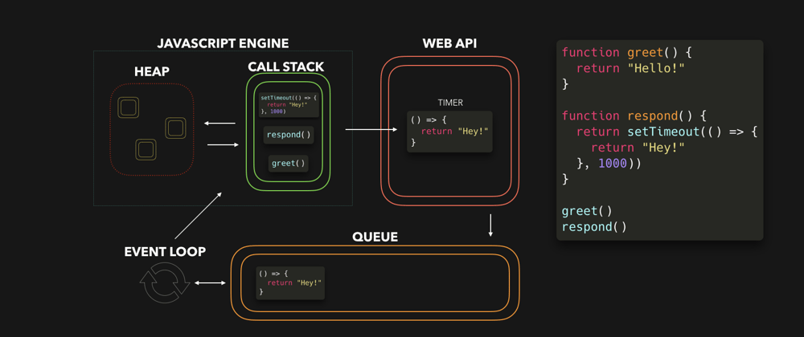

# 동기 VS 비동기, Promise와 async/await

## 1. 동기,비동기란

**동기**

자바스크립트는 “싱글 스레드” 방식이기 때문에, 한번에 하나의 태스크만 처리할 수 있다.<br/>
이렇게 하나의 작업이 끝날 때까지 다음 작업이 대기하는 방식이 동기 처리이다.

```js
// taskOne의 처리가 끝나기 전 까진 taskTwo는 대기하게 된다. 
function taskOne() {
  for (let i = 0; i < 1000000000; i++) {} // 시간이 걸리는 작업
  console.log("taskOne");
}

function taskTwo() {
  console.log("tasktwo");
}

taskOne();
taskTwo();
```

**비동기**

하지만 현재 실행 중인 작업이 종료되지 않은 상태라도, 다음 작업을 곧바로 실행할 수 있다. 
<br/>이것이 비동기 처리.<br/>
비동기 처리 요청을 보낸 후 응답 여부와 상관없이 다음 태스크를 병렬적으로 수행할 수 있는 방식이다.<br/>
이 방식은 http 요청, 타이머 설정, 이벤트 핸들러 등 시간이 오래 걸리는 작업을 처리할 때 유용하다.

```js
// taskOne을 먼저 호출했지만 setTimeout은 taskTwo가 실행된 이후에 실행된다.
// 비동기 콜백 함수(setTimeout)는 작업이 바로 완료되지 않고, 이후에 실행될 수 있다.
function taskOne() {
  setTimeout(() => { 
    console.log("taskOne");
  }, 1000);
}

function taskTwo() {
  console.log("tasktwo");
}

taskOne();
taskTwo();
```
<br/>


## 2. 비동기 처리는 어떻게 가능한 것인가?
이런 비동기 처리는 브라우저에서 실행되는 1)이벤트 루프와 2)태스크 큐를 통해 가능하다. <br/>

비동기 함수는 바로 실행되는게 아니라 먼저 태스크 큐에 등록된다.<br/> 
이 후, 이벤트 루프가 콜 스택에 실행 중인 작업이 없음을 감지하면, 큐에 있는 작업을 콜 스택으로 이동시킨다.<Br/>
그제서야 비동기 함수가 실행되는 것이다. <br/> 

이게 무슨 말인지 아래의 그림의 코드를 예로 자세히 설명해보겠다. 
[(※ 출처)](https://dev.to/lydiahallie/javascript-visualized-promises-async-await-5gke)


  
 
1. 자바스크립트 엔진 구성 - Heap과 Call Stack<br/> 
  Heap 
     - 동적으로 생성된 객체들이 저장되는 메모리 영역 
     - call stack에서 함수가 실행될 때, 실행 중 필요한 객체는 Heap에서 참조하게 되는 것이다.
  
    Call Stack
     - 함수 호출이 쌓이고 제거되는 곳. (실행 컨텍스트 스택) <br/>
     - 함수가 실행될 때 Call Stack에 쌓이고, 실행이 완료되면 Call Stack에서 제거된다.<br/>
     - 자바스크립트는 싱글 스레드로 동작하므로 한 번에 하나의 작업만 이 스택에서 실행되는 것이다.<br/>
<br/>
1. Call Stack에서 함수 실행<br/>
  greet() 함수 호출하면 → greet함수가 Call Stack에 들어와 실행 → 실행 완료 후 → Call Stack에서 제거된다.<br/>
  이후, respond() 함수 호출되면 → Call Stack에 들어와 실행 → setTimeout이 실행된다.
  
  <br/>

3. Web API로 비동기 작업 위임<br/>
  setTimeout은 브라우저에서 제공하는 Web API로 타이머 작업을 백그라운드에서 처리하도록 넘겨진다.<br/>
  여기서 타이머(1000ms)가 완료될 때까지 Call Stack은 중단되지 않고, 그 사이에 다른 작업들을 계속 처리할 수 있다.

    ```js
    console.log("Start");

    setTimeout(() => {
      console.log("This is delayed"); // 비동기 콜백함수는 web api로 위임되고,
    }, 1000);

    console.log("End"); // 1000ms 후에 실행되는 비동기 작업을 기다리지 않고, 다음 작업을 바로 실행한다.
    ```

  <br/>

4. Queue에 작업 추가

    타이머가 완료되면, setTimeout 콜백 함수`(() => { return "Hey!" }`)가 Queue로 이동한다.<br/>
    Queue는 두가지로 나뉜다.
   - 마이크로 태스크 큐: 프로미스의 후속 처리 메서드(then, catch, finally)에 사용된 "콜백 함수"가 저장.
   - 매크로 태스크 큐: setTimeout과 같은 타이머의 "콜백 함수"나 이벤트 핸들러가 저장됨.

5. Event Loop (이벤트 루프)
   
    Queue는 이벤트 루프에 의해 관리된다.<br/>
   이벤트 루프는 Call Stack이 비어 있는지 확인한다.<br/>
   Call Stack이 비어 있으면, Queue에 있는 작업을 Call Stack으로 가져와 실행하게 된다.

6. 콜백 함수 실행

    setTimeout의 콜백 함수가 Call Stack으로 이동해 실행된다.

 <br/> 

## JS에서 비동기 처리 다루는 방식

### 1. 콜백 함수

**비동기 작업에서의 콜백 함수란** <br/>
: 비동기 작업이 완료되면 호출되는 함수<br/>
 

**콜백 헬** <br/>
비동기 작업을 순차적으로 처리하기 위해, 콜백 함수 안에 다음에 실행할 콜백함수를 넣게되는데 <br/>
이렇게 콜백함수가 계속 중첩되면서 코드의 뎁스가 깊어져 코드가 복잡해지는 현상이다.<br/>

```js
// script1로드 후에, script2 로드, script3 로드하는 비동기 작업 연결

loadScript('/my/script1.js', (script) => {
  loadScript('/my/script2.js', (script) => {
    loadScript('/my/script3.js', (script) => {
      // 세 스크립트 로딩이 끝난 후 실행됨
    });
  })
});
``` 
<br/>

**왜 콜백 헬이 문제되는가?**
1. 가독성 문제
- 뎁스가 깊어짐: 비동기 실행 이후로 후속 코드를 위해서는, 그 콜백 함수 내부에서 다 처리를 해야한다.
 - 코드 흐름을 순차적으로 이해하기 어려움 : 중첩된 콜백 함수를 따라가며 읽어햐 함
   
<br/>

2. 에러 처리의 어려움
: 동기 코드에서처럼 try-catch 문으로 에러 처리할 수 없다. 
    ```js
      try {
        setTimeout(() => {throw new Error("Error!");}, 1000);
      } catch (error) {
        console.error(error);
      }
    ```
    setTimeout의 콜백함수가 실행될 시점에는, 이미 try{}catch{} 부분은 동기 실행으로 모두 실행이 종료된 상태다.<br/>
    이후 비동기 실행만 덩그러니 실행되는 꼴이므로, 에러 객체는 catch로 받을 수 없게된다.


<br/>

### 2. Promise

**<Promise란?>** <br/>
비동기 작업의 성공 또는 실패를 처리하고, 후속 작업을 체계적으로 연결할 수 있는 JavaScript의 내장 객체

콜백 헬 해결<br/>
- Promise로 인해 비동기 작업이 여러개가 중첩되도 콜백 지옥 해결할 수 있게되었다.<br/>
- 코드의 깊이가 깊어지지 않는다.

<br/>

**<Promise 객체>**

```js
function myPromise() {
  return new Promise((resolve, reject) => {
      const data = fetch();

      if (data) {
        resolve(data);
      } else {
        reject("Error");
      }
  });
}

myPromise()
  .then((value) => {
    console.log("Success:", value); // "Success: data값"
  })
  .catch((error) => {
    console.error("Error:", error); // "Error: Error"
  })
  .finally(() => {
    console.log("Operation complete");
  });
```

- Promise 생성자에는 executor라는 콜백 함수를 인자로 받는다.
- 그리고 executor 함수는 `resolve` 및 `reject`를 매개변수를 가진다.
  
  - **`resolve(value)`**<br/>
    : 비동기 작업이 성공적으로 완료되었을 때 호출된다.<br/>
    : resolve의 매개변수 value는 성공시  전달할 값이다.<br/>
    : 이 값은 `.then()` 메서드의 첫 번째 콜백함수로 전달되어 후속 작업에 사용된다.

  - **`reject(error)`**<br/>
    : 비동기 작업이 실패했을 때 호출된다.<br/>
    : reject의 매개변수 error는 실패 시 전달할 값이다.<br/>
    : 이 값은 `.catch()` 메서드의 첫 번째 콜백함수로 전달되어 에러 처리에 사용된다.

<br/>

<b> < Promise 상태 > </b>

pending (대기중)
- Promise 객체는 `resolve` 또는 `reject`가 호출될 때까지 기다리게 된다.<br/>
- 이 상태에서는 then,catch가 실행되지 않는다.

fulfilled (성공)
- `resolve`가 호출되면, Promise는 fulfilled(성공) 상태로 바뀌고, `.then()`에서 후속작업 처리<br/>

rejected (실패) 
- `reject`가 호출되면, Promise는 rejected(실패) 상태로 바뀌고, `.catch()`에서 후속작업 처리

Promise는 상태가 한 번 결정(settled)되면 더 이상 변경되지 않는다.
때문에 fulfilled, rejected 상태를 settled 상태라고도 표현한다.

<br/>

**< 후속 처리 메서드 >**
1) `then(onFulfilled, onRejected)` <br/>
  `resolve`로 반환된 값은 `.then()`의 첫 번째 콜백 함수의 매개변수로 전달된다.
     -  첫번째 인자 (onFulfilled)<br/>
     : Promise가 수행될 때 호출되는 Function으로, 이행 값(fulfillment value) 하나를 인수로 받는다.<br/>
     -  두번째 인자 (onRejected)<br/>
     : Promise가 거부될 때 호출되는 Function으로, 거부 이유(rejection reason) 하나를 인수로 받는다.
     
  - 프로미스 체이닝 : `.then()`은 새로운 Promise 객체를 반환한다. 때문에 또 then()을 이어서 프로미스 체이닝이 가능하다.

<br/>

2) catch<br/>
    `reject`로 반환된 값은 `.catch()`의 첫 번째 콜백 함수의 매개변수로 전달된다.<br/>
-  프로미스 체이닝 : `catch()`는 새로운 Promise 객체를 반환한다. 때문에 그 뒤에 then()을 이어서 프로미스 체이닝이 가능하다.


<br/>

3) finally<br/>
  resolve와 reject의 결과와 관계없이 항상 실행된다.<br/>
  주로 로딩 스피너 제거와 같은 정리 작업에 사용된다.
    ```js
    myPromise()
    .then((value) => console.log("Success:", value))
    .catch((error) => console.error("Error:", error))
    .finally(() => console.log("Cleanup complete"));
    ```
 
 <br/>

### <Promise 한계>

then 메서드로 프로미스 체이닝하여 비동기 처리 흐름을 이어나갈 수 있지만, <br>
then이 여러개 중첩되어 여전히 콜백 헬과 비슷한 문제 발생하게 된다.<br>

```js 
fetch('https://example.com/api')
  .then(response => response.json())
  .then(data => fetch(`https://example.com/api/${data.id}`))
  .then(response => response.json())
  .then(data => fetch(`https://example.com/api/${data.id}/details`))
  .then(response => response.json())
  .then(data => console.log(data))
  .catch(error => console.error(error)); 
```

<br/>

## 3. async-await
 
위의 promise체이닝의 한계를 해결하기 위해 async-await를 활용할 수 있다.<br/>
 
- 가독성 향상<br/>
: async-await을 사용하면 비동기 코드가 마치 동기 코드처럼 작성되어, 코드 흐름을 쉽게 이해할 수 있다.<br/> 
  각 비동기 작업을 기다리는 동안 코드가 일시 중지되고 순차적으로 실행되기 때문에 코드가 직관적이고 읽기 쉬워진다.<br/>
  
   
- 간단한 코드<br/>
  : then, catch, finally 등의 후속 처리 메서드를 사용하지 않고도, 동기 실행 코드처럼 간결하게 작성할 수 있다.<br/>
 
<br/>
   

```js
// await를 통해 프로미스가 처리될 때까지 기다리며, 이후 코드를 순차적으로 실행하게 된다.

  async function getData() {
    const response = await fetch('https://example.com/api');
    const data = await response.json();
    const response2 = await fetch(`https://example.com/api/${data.id}`);
    const data2 = await response2.json();
    const response3 = await fetch(`https://example.com/api/${data.id}/details`);
    const data3 = await response3.json();
    console.log(data3);
  } 

  getData();
```

<br/>

**<async await 사용법>** <br/>
async
- 용도 : await를 사용하고자 하는 함수에 붙인다.
- 반환값 : async 함수는 항상 Promise를 반환한다.
    - 반환값이 있다면 자동으로 반환값이 resolve된 프로미스를 반환한다. (프로미스 안에 값이 resolve된 꼴)
    - 반환값이 없으면 undefined를 resolve하는 프로미스를 반환한다. 
  ```js
  async function example() {
    return 42; // 자동으로 resolve된 Promise(42)를 반환
  }

  example().then(value => console.log(value)); // 출력: 42
  ```

<br/>

await
- 용도 : promise 작업이 settled (resolved, rejected) 될 때까지 다음 코드 실행을 일시 중지한다.
- 사용 위치 : async함수 내부에, Promise 인스턴스 앞에 붙임.
- 반환값 
    -  Promise가 resolved 상태일 경우, 프로미스가 resolve한 처리 “결과 값”만을 반환한다.
    -  Promise가 rejected 되면, await는 에러를 throw 한다.
- 순차적 실행 보장 : await를 활용하면 비동기 작업을 순차적으로 처리할 수 있다.

```jsx
async function fetchTodo(){
	const res = await fetch("https://url"); // fetch는 프로미스를 반환. await를 통해 프로미스의 처리결과 값만 반환
	const todo = await res.json(); // json()도 프로미스를 반환. await를 통해 프로미스의 처리 결과 값만 반환
	console.log(todo)
} 
```

**< async/await 에서의 에러처리 >**

1. try…catch문 사용한 에러처리<br/>
- try...catch를 사용하면 코드 블록 내에서 발생한 모든 예외를 catch에서 한 번에 처리 가능하다.
- 네트워크 에러와 다른 예외적인 상황(JSON 파싱 오류, 런타임 오류 등)을 모두 catch에서 처리할 수 있다.

```jsx
async function fetchTodo() {
  try {
    const res = await fetch("https://url"); // http 에러
    const todo = await res.json(); // 런타임 에러
  } catch (err) {
    console.error("Error occurred:", err); // 모두 잡을 수 있음
  }
}
```

1. catch 메서드 사용한 에러처리<br/>
async 함수에서 try...catch 문을 사용하지 않으면, 예외가 발생할 경우 자동으로 rejected 상태의 프로미스가 반환된다.<br/> 
따라서 then과 catch 메서드를 통해도 후속 처리가 가능하다.

```jsx
const foo = async function fetchTodo() {
  const res = await fetch("https://url");
  const todo = await res.json();  
};

foo()
  .then(() => console.log("success"))
  .catch(() => console.log("err"));
```


---

참고 문서<br/>
https://www.lydiahallie.com/blog/event-loop<br/>

[https://inpa.tistory.com/entry/JS-📚-자바스크립트-콜백-함수](https://inpa.tistory.com/entry/JS-%F0%9F%93%9A-%EC%9E%90%EB%B0%94%EC%8A%A4%ED%81%AC%EB%A6%BD%ED%8A%B8-%EC%BD%9C%EB%B0%B1-%ED%95%A8%EC%88%98)<br>

[https://inpa.tistory.com/entry/🌐-js-async](https://inpa.tistory.com/entry/%F0%9F%8C%90-js-async)<br>

[https://inpa.tistory.com/entry/JS-📚-비동기처리-Promise](https://inpa.tistory.com/entry/JS-%F0%9F%93%9A-%EB%B9%84%EB%8F%99%EA%B8%B0%EC%B2%98%EB%A6%AC-Promise)<br>

[https://inpa.tistory.com/entry/JS-📚-비동기처리-async-await](https://inpa.tistory.com/entry/JS-%F0%9F%93%9A-%EB%B9%84%EB%8F%99%EA%B8%B0%EC%B2%98%EB%A6%AC-async-await)<br>

[https://velog.io/@khy226/동기-비동기란-Promise-asyncawait-개념](https://velog.io/@khy226/%EB%8F%99%EA%B8%B0-%EB%B9%84%EB%8F%99%EA%B8%B0%EB%9E%80-Promise-asyncawait-%EA%B0%9C%EB%85%90)

https://emewjin.github.io/core-javascript/4/

 