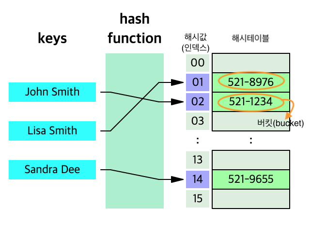
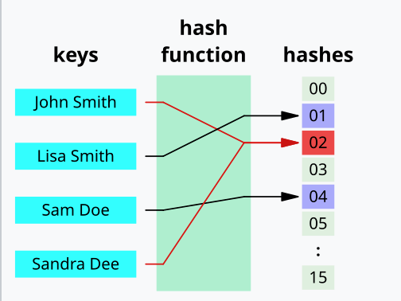
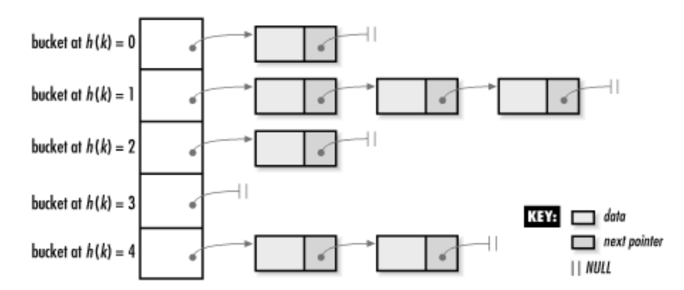

### ✅ 해시란

해시 함수를 사용해서 변환한 값을 "인덱스"로 삼아, "키와 값"을 저장해서 빠른 데이터 탐색을 제공하는 자료구조이다.  
해시는 키와 데이터를 1:1로 저장하므로, 키를 통해 데이터에 바로 접근할 수 있다.  
키 자체가 해시 함수에 의해 인덱스가 되므로, 값을 찾기 위한 탐색 과정이 필요 없는 것이다. `O(1)`

 

### ✅ 해시 함수

1. 반환값
해시 함수가 반환한 값은 해시테이블의 인덱스로 활용해야 되서, 해시 테이블 크기를 넘으면 안된다. 
해시 테이블 크기가 N이라면 해시 함수가 반환할 수 있는 값은 0~(N-1)이다.

2. 충돌이 최대한 적게 발생해야 한다.
- 충돌 : 해시 함수가 반환한 값이 동일해서, 두 키의 인덱스가 동일하여 저장 위치가 충돌되는 현상. 
 

 

### ✅ 충돌 처리

### 1. 체이닝으로 처리

데이터 A와 B가 둘다 똑같은 인덱스 1이라면 충돌이 발생한다. 
이때 인덱스 1에 연결 리스트로 충돌된 데이터를 연결하여 저장하여 충돌을 해결한다.

 

- 장점 : 간단하다   

- 단점1. 공간 활용성 떨어짐   충돌이 많아지면 그만큼 연결리스크 길이가 길어지고, 다른 해시테이블 공간을 덜 사용하게 된다.
 

- 단점2. 검색 성능 떨어짐   연결리스트로 연결된 값을 찾으려면 연결리스트를 맨 앞 부터 검색해야 한다.

 

### 2. 개방 주소법으로 처리

충돌 발생시 빈 버킷을 찾아 충돌값을 삽입한다.

**<선형 탐사 방식>**

충돌 발생하면 다음 빈 공간을 탐색하여 값을 저장한다. (다른 빈 버킷을 찾을 때까지 일정한 간격으로 이동한다.)

- 장점  
테이블을 최대한 활용하므로 메모리를 더 효율적으로 사용할 수 있다. (한 메모리에 여러개 저장하지x)
 

- 단점 
 해시 충돌이 발생한 값끼리 모이는 영역이 생기게 된다. 즉, 클러스터를 형성하게 된다. 
때문에 이런 군집이 생기면 해시값은 겹칠 확률이 더 올라가게 된다.

 

**<이중 해싱 방식>**

해시 함수를 2개 사용하는 방식이다. 

- 기존과 마찬가지로 하나의 해시함수는 최초 해시를 얻을 때 사용하고, 다른 하나는 충돌이 났을 경우 탐사 이동폭을 얻기 위해 사용한다. 
두번째 함수는, 첫 번째 해시 함수에서 충돌시 위치를 어떻게 정할지 결정하는 역할을 한다. 

- 이렇게 하면 위의 방법들보다 다른 공간에 값이 골고루 저장될 확률이 높아진다. (클러스터 형성을 최대한 피할 수 있게된다.)

 

### ✅ 해시 함수 종류

### 1.나눗셈법

**나눗셈법-** 데이터를 해시 테이블 크기로 나눠서 나머지를 사용.   `*h*(*x*) = *x* mod *m*`

- 입력 값 x를 해시 테이블 크기 m으로 나눈 나머지를 주소로 사용한다.
  
- 나눗셈법은 0부터 *m*−1 사이의 주소 반환한다.
- 나눗셈법을 쓸 경우 테이블 내 공간을 효율적으로 사용하기 위해 테이블의 크기를
 “소수”(1과 자신 뺴고는 약수가 없는 수)로 정하는 것이 좋다.
- 왜 소수를 활용하는가? - 데이터가 특정한 패턴을 가지면 충돌이 생기기 쉬워서.
    - m이 소수가 아니면, x값이 특정 패턴으로 들어오면서 해시값이 고르게 분포되지 않을 가능성이 커서
    - ex) m이 10이면, 나머지가 0,2,4,6,8 에만 집중되서 해시 충돌 발생한다. 
    0 % 10 = 0 / 2 % 10 = 2 / 4 % 10 = 4 / 6 % 10 = 6 / 8 % 10 = 8 /10 % 10 = 0 /12 % 10 = 2… 계속 0,2,4,6,8만 반복됨.

     

- 장점
 가장 간단한 해시 함수 알고리즘 이다. 

- 단점  
해시 테이블의 크기는 m 이여서 아주 많은 데이터를 저장해야 한다면 엄청 큰 소수가 필요할 수도 있고  이때 큰 소수를 구하기도 쉽지 않음.

### 2.곱셈법

**곱셈법-** 데이터를 특정 값과 곱한 후 소수점 부분으로 계산.  `*h*(*x*) = ( (*x * A*)mod1) * *m )*`

1. 입력값 x에 A를 곱한 뒤, 그 값의 소수점 부분만 추출한다.
    - A는 소수점 값이다. (ex) 0.618033)
   

2. 이후 그  소수점 값을 가지고 테이블 크기(m)을 곱하여 정수 값을 추출한다.
3. 이 값이 테이블의 인덱스 값이 된다. 
해시함수가 반환한 인덱스의 범위는 0~(m-1)이 된다.

 

- 장점 : 소수가 필요 없다.
- 단점 : 해시 테이블 크기가 커져도 추가 작업이 필요 없다.

### 3. 문자열 해싱

**문자열 해싱-** 문자열을 숫자로 변환하고, 가중치를 더한 후 테이블 크기로 나눔.

- 문자 하나하나를 숫자로 바꾼 후, 모두 더하여 해시 값을 만든다.

(예시) "abc"라는 문자열

1. 각 글자의 숫자 값(ASCII 값):
    - 'a' = 97 , 'b' = 98 , 'c' = 99
2. 가중치를 주면서 계산:
    - 97 * 1(31^0) = 97   / 98 * 31¹(31^1) = 3038  / 99 * 961(31^2) = 95139
3. 총합:
    - 97+3038+95139=98274
    - 이 값을 해시 테이블 크기만큼 나눠서 번호를 정한다.

 

---- 

면접 예상 질문

 

1. 해시란 무엇인가요?  
해시는 데이터를 `키-값 쌍`으로 저장하고, 키를 `해시 함수`에 넣어 계산한 값을 `해시테이블의 인덱스로` 사용하여 
`빠르게 데이터에 접근`할 수 있는 자료구조입니다. 
데이터 탐색이 평균적으로 `𝑂(1)` 의 `시간 복잡도`를 가지기 때문에 매우 효율적입니다.

 

2. 해시의 장점과 단점은 무엇인가요? 
장점 
: `키`를 통해 `데이터에 직접 접근`하므로, 평균 O(1)로 `빠른 탐색`이 가능하여 대규모 데이터 처리에 유리합니다. 

    단점  
    `충돌 처리 비용`이 발생할 수 있습니다. 
    해시 테이블 크기를 사전에 정해야 하며, 크기 조정이 어려울 수 있습니다. 
    해시 함수가 비효율적이면 성능이 저하될 수 있습니다. 

 

3. 해시는 어디에 활용되나요? 
특정 데이터를 탐색하는 횟수가 많을 경우 해시를 고려하면 좋다.
- 캐싱: 자주 사용하는 데이터를 빠르게 접근하기 위해 사용됩니다. 
- `데이터베이스 인덱싱`: 대용량 데이터를 효율적으로 관리. 
- 검색 엔진: `키워드 검색` 시 빠르게 결과를 제공. 

 

4. 해시 함수의 특징은 무엇인가요? 
해시 함수는 주어진 키를 고정된 크기의 값(인덱스)으로 변환합니다. 
좋은 해시 함수는 다음 두 가지를 만족해야 합니다. 
   1) 균등 분포: 키를 가능한 고르게 분포시켜 충돌을 최소화합니다. 
   2) 효율성: 계산 속도가 빠르고, 반환값은 해시 테이블 크기를 넘지 않습니다. 

 

5. 해시에서 충돌이란 무엇인가요? 
충돌은 서로 `다른 키`들이 해시 함수에 의해 `동일한 인덱스`를 반환하는 경우를 의미합니다. 
충돌이 빈번하게 일어나면, 해시테이블 내에 데이터가 `몰려있는 상태`가 되서 `탐색 시간`이 길어지고 결국 해시 테이블의 효율성을 저하됩니다. 

 

6. 충돌을 어떻게 해결하나요? 
충돌 해결 방법에는 체이닝과 개방 주소법이 있습니다 
 

- 체이닝(Chaining): 
같은 인덱스에 여러 값을 저장할 때 `연결 리스트`를 사용합니다. 
장점: `간단`하며 추가 작업이 적음. 
단점: 충돌이 많아지면 `검색 시간이 O(n)`로 느려질 수 있음. 
 

- 개방 주소법(Open Addressing): 
충돌 발생 시 테이블에서 `빈 공간을 찾아` 데이터를 저장합니다. 
대표적인 방식: 선형 탐사, 이중 해싱. 
장점: 테이블을 최대한 활용하므로 `메모리를 더 효율`적으로 사용할 수 있다. (한 메모리에 여러개 저장하지x)  
단점: 충돌 데이터가 모여 `클러스터가` 생길 수 있음. 

