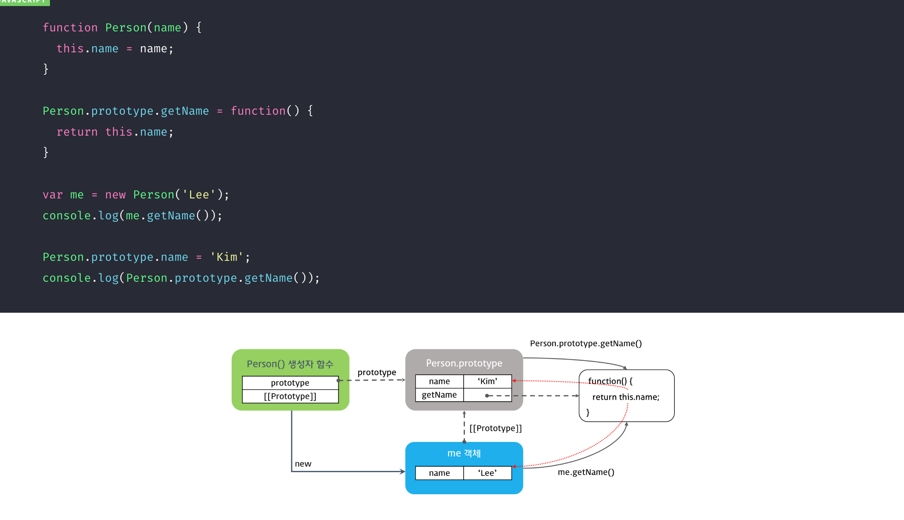

# 코어 자바스크립트 3장.THIS

this란?

- 자신이 속한 객체 또는 자신이 생성할 인스턴스를 가리키는 자기 참조 변수(self-reference variable)
- 함수 “호출”할 때 결정됨
  : 함수 호출시 → 실행 컨텍스트 생성 되면서 + this 결정됨

## **1. 전역에서의 this**

전역에서의 this = "전역객체,window"

※ 전역 변수로 선언 VS 전역객체에 프로퍼티로

- 공통 : 둘다 실행 컨텍스트의 렉시걸 환경에 등록되어, window 객체의 프로퍼티로 등록됨.
- 차이

  ```js
  // 전역 변수로 선언
  // 1. 호이스팅 가능
  // 2.configurable = false (의도치 않게 삭제하는 것 방지 위해 delete 연산자로 삭제 안됨)
  var a = 1;
  delete window.a; // false - 삭제 불가

  // 전역 객체의 프로퍼티로 등록
  // 1. 호이스팅X
  // 2. configurable = true - 삭제 가능
  window.a = 1;
  delete window.a; // true
  ```

<br/><br/>

## **2. 메서드 내에서 this**

### 함수 VS 메서드

1.  함수

- 객체와 관계없이 독립적으로 존재(독립성ㅇ)
- 함수로서 호출 : 함수명 앞에 객체가 명시되지 X
- this : window (이유 : 함수를 호출한 주체는 개발자가 직접 호출시킨 것. 따라서 this 가 지정되지X)
- 일반 함수로 호출되는 경우

  - 콜백함수도 그냥 함수임. 때문에 this는 전역객체(window).
    ```jsx
    setTimeout(function(){console.log(this)},100) // window
    [].forEach(function(){console.log(this)}) // window
    ```
  - 메서드로 정의한 “중첩함수”가 일반함수로 호출되면, this는 전역객체(window)

    ```jsx
    const obj = {
      value: 100,
      foo() {
        console.log(this); // [p1] obj객체 {value:100, foo : fn()}
        function bar() {
          console.log(this); // [p2] window
        }
        bar(); // [p2]일반함수 호출
      },
    };

    obj.foo(); // [p1]메서드 호출
    ```

2.  메서드

- 객체의 속성으로 정의됨, 자신을 호출한 객체에 관한 동작 수행 (독립성X)
- 메서드로서 호출 : 함수명 앞에 객체가 명시됨 (`obj.func(1)` , `obj[’func'](1)`)
- this : 점 앞에 명시된 객체 (이유 : 메서드를 호출한 주체는 점 앞의 객체임)
  <br/>
  <br/>

### this를 변수에 저장해서 활용하기

- 상위 스코프의 this를 변수에 저장 → 내부함수에서 그대로 활용

  ```jsx
  const person = {
    name: "Alice",
    greet: function () {
      console.log(this); // person 객체
      setTimeout(function () {
        console.log(this); // window 객체
      }, 100);

      const that = this; // this를 변수에 저장하여 사용
      setTimeout(function () {
        console.log(that); // person 객체
      }, 100);
    },
  };

  person.greet();
  ```

<br/><br/>

## 3. 화살표함수 내에서의 this

arrow함수 내에서의 this는 : "한단계 위의 스코프의 this"

```jsx
class Person {
  constructor(name) {
    this.name = name;
  }

  outerFunction() {
    console.log("111", this); // person 객체 (메서드로서 호출, 점 앞의 객체)

    setTimeout(function () {
      console.log("222", this.name); // window (일반함수임)
    }, 1000);

    setTimeout(() => {
      console.log("333", this.name); // Alice (화살표 함수는 상위 스코프의 this를 그대로 사용)
    }, 1000);
  }
}

const person = new Person("Alice");
person.outerFunction();
```

<br/><br/>

## **4. 생성자 함수 내에서 this**

생성자 함수 내부의 this = 생성자 함수로 인해 “생성될 인스턴스 객체”에 바인딩 됨.

```jsx
function Circle(num) {
  this.radius = num; // this는 인스턴스 객체
  this.diameter = function () {
    return this.radius * 2; // this는 인스턴스 객체
  };
}

const circle1 = new Circle(5); // { radius: 5, diameter: {Function]}
const circle2 = new Circle(10); // { radius: 10, diameter: {Function]}
console.log(circle1.diameter()); // 10
console.log(circle2.diameter()); // 20
```



<br/><br/>

## 5. 이벤트 핸들러 내에서의 this

"이벤트 핸들러를 바인딩한 dom 요소"가 this가 됨.

```jsx
const InputEl = document.getElementsByTagName("input");

InputEl.addEventListener("change", function () {
  console.log(this); // 이벤트 핸들러 내에서의 this는 InputEl요소를 가리킴.
});
```

<br/><br/>

## 6. apply,call,bind (직접 this 바인딩 하기) 📍

### 6-1. apply,call,bind 비교

> `apply(thisArg, argsArray)` : apply/call 메서드를 호출한 함수가 즉시 호출됨 / 인자 - 배열<br/> `call(thisArg, arg1, arg2)` : apply/call 메서드를 호출한 함수가 즉시 호출됨 / 인자 - 콤마로 나열<br/> `bind(thisArg, arg1, arg2)` : 즉시호출X, 명시적으로 함수를 호출해줘야 함 / 인자 - 콤마로 나열<br/>
> ㄴ 넘겨받은 this와 인수를 바탕으로 “새로운 함수를 반환”만 하고 실행은 즉시 되지 않음<br/> <br/>
> (thisArg : 함수 내부에서 this로 사용될 값 / argsArray : 함수 호출시 전달된 인자)

- apply

  ```jsx
  var func = function (a, b, c) {
    console.log(this, a, b, c);
  };

  func.apply({ a: 1 }, [4, 5, 6]); // {a:1} , 4,5,6

  var obj = {
    a: 1,
    method: function (x, y) {
      console.log(this.a, x, y);
    },
  };

  obj.method.apply({ a: 4 }, [5, 6]); // 4,5,6
  ```

- bind

  ```jsx
  var func = function (a, b, c, d) {
    console.log(this, a, b, c, d);
  };
  const bindFunc1 = func.bind({ a: 1 }, 1, 2); // {a:1},1,2
  bindFunc1(3, 4); // {a:1},1,2,3,4

  ※
  // console.log(func.name); // func
  // console.log(bindFunc1.name); // bound func <- bind메서드를 적용하여 새로 만든 함수
  ```

  <br/>

### 6-2. 유사배열객체에 call,apply 사용

유사배열객체 : 배열처럼 “**인덱스**”와 “**length 속성**”을 가지고 있지만, 실제로는 배열이 아닌 객체<br/>
<br/>

<details>
<summary><b> ※ 대표적인 유사배열객체 종류<b/></summary>
<div markdown="1">

1. arguments 객체

- 함수에 전달된 “**매개변수**” **정보와 인수 목록**이 있음.
- “함수가 실행”될 때 "실행 컨텍스트" 생성되면서 + “argements” 같이 만들어짐.
- 화살표 함수에서는 arguments 없음.

```jsx
function showArguments(a, b) {
  console.log(arguments); // 유사 배열 객체 { '0': 10, '1': 20, '2': 30 }
  console.log(arguments.length); // 인수의 개수 출력, 3
  console.log(arguments[0]); // 인덱스로 접근 가능
}

showArguments(10, 20, 30);
```

2. NodeList

```jsx
const divs = document.querySelectorAll("div");
console.log(divs); // NodeList(3) [div, div, div]
```

3. HTMLCollection

```jsx
const elements = document.getElementsByClassName("example");
console.log(elements); // HTMLCollection(2) [div.example, div.example]
```

4. 문자열
5. 등
여기에 네모 테두리 박스 안에 들어갈 내용을 작성하세요.
</div>
</details>

<br/> 
- 유사배열객체에서 call,apply 메서드를 이용해 모든 배열 메서드를 차용할 수 있음

```jsx
function func() {
  console.log(arguments); // [Arguments] { '0': 1, '1': 2, '2': 3 } 유사 배열 객체

  const argsArray = Array.prototype.slice.call(arguments);
  // slice 메서드의 this가 arguments로 됨

  console.log(argsArray); // [1, 2, 3]  배열로 변환
}

func(1, 2, 3);
```

<br/>
- 문자열도 마찬가진데, 문자열은 length가 “읽기전용”임.<br/>
때문에 원본 문자열을 변경하는 메서드는 에러남. (push,splice 등)

```jsx
function func(str) {
  const result = Array.prototype.slice.call(str);
  console.log(result); // [ 's', 't', 'r', 'i', 'n', 'g' ]

  const result2 = Array.prototype.push.call(str, 2);
  console.log(result2);
  // TypeError: Cannot assign to read only property '0' of object '[object String]'
}

func("string");
```

<br/>

**<유사 배열 객체를 배열로 변환 하는 법>**

1. call,apply 활용하여 배열 메서드 사용 차용 (ES5 이하) : 본래 메서드의 의도와 동떨어진 방법
   `[].slice.call(arguments);`
2. Array.from() (ES6 부터) : 유사배열 뿐 아니라 순회가능한 모든것을 배열로 전환함

   `Array.from(arguments);`

3. 스프레드 연산자 사용 (ES6 부터)<br/>
   `[...document.querySelectorAll("div")];`

<br/>

---

<br/>
읽기 - https://poiemaweb.com/js-this
