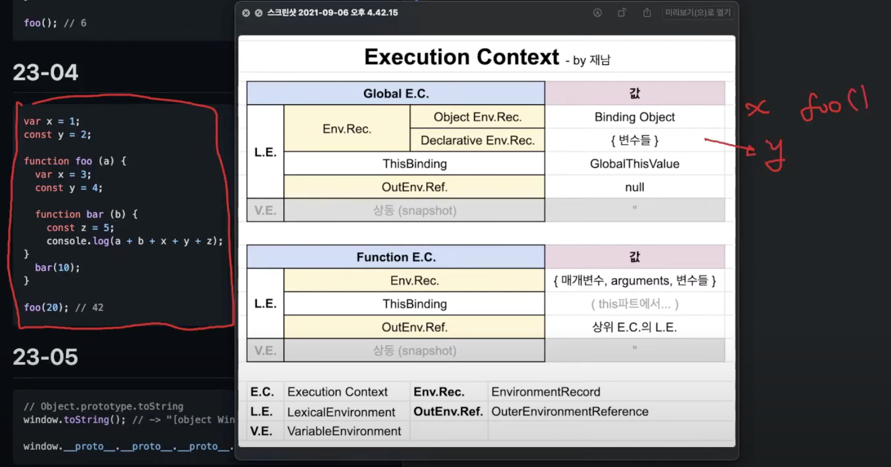

# 실행 컨텍스트(Execution Context)

실행할 코드에 제공할 환경 정보를 모아놓은 객체
코드의 "실행 순서"와 "스코프 및 식별자(변수명,함수명 등)"를 관리하기 위한 메커니즘

- 실행 컨텍스트가 하는 일
  1. 실행 컨텍스트 스택 : 코드의 “실행 순서” 관리
  2. 렉시컬 환경 : “스코프”와 “식별자” 관리
     <br/><br/>
- 생성 단위
  - 전역 코드 : 스크립트 파일 전체가 실행될 때, 전역 실행 컨텍스트 생성
  - 함수 코드 : 함수 호출될 때 마다, 함수 실행 컨텍스트 생성
  - eval 코드 : eval() 함수 호출될 때 마다, eval 실행 컨텍스트 생성
  - 모듈 코드 : 모듈 실행 컨텍스트 생성

### <EC 생성 과정>

- 전역 렉시컬 환경: 스크립트 코드가 로드될 때(코드가 실행되기 전에) 바로 생성됨
- 햠수 렉시컬 환경 : “함수 호출”시 실행 컨텍스트 생성됨
  <br/><br/>

1. 평가 단계 (런타임 전) : 변수 선언, 함수 선언

- 환경 레코드 (Environment Record)<br/>
  `var a;` : 식별자 a만 환경 레코드에 등록되고, undefined로 초기화 됨<br/>
  `let const a;` : 식별자 a만 환경 레코드에 등록되고, 초기화 되진X<br/>
  `함수 선언문` : 함수 선언문이 환경 레코드에 등록됨 (식별자 뿐 아니라, 함수 자체가 즉시 다 할당됨)

2. 실행 단계 (런타임 후) : 값 할당

- 환경 레코드에 실제 값 할당됨. `a = 1;`




참조 : [유투브](https://www.youtube.com/watch?v=NKEOFnMtBh8&list=PLjQV3hketAJnP_ceUiPCc8GnNQ0REpCqr&index=7)

<br/> <br/>

# 호이스팅

**런타임 이전 (선언만)**

- var : 변수 선언 + undefined 로 초기화
- let,const : 변수 선언만 (초기화X)
- 함수 선언문: 함수 선언 + 함수 객체 (전체 함수가 메모리에 올라감)

**런타임 이후 (값 할당)**

- var : 실제 값을 할당함
- let, const : 값 할당함 <br/><br/>

### 호이스팅이란

: 변수나 함수의 선언문이 스코프의 선두로 끌어 올려진 것 처럼 보이는 현상.

### 변수 호이스팅

1. var, let, const는 모두 호이스팅이 가능하다.

- 이유 : 런타임 이전에 선언이 먼저 이뤄져서
  (변수 선언 뿐만 아니라 함수,클래스 등 "모든 선언문"은 런타임 이전에서 먼저 실행되어 호이스팅 됨)

2. var는 변수 선언 전에 변수를 참조도 에러나지 않는다.

- "변수 선언"과 "초기화"가 한번에 진행되서

3. 그러나 let, const는 호이스팅이 안되는 것 처럼 보인다.(사실 호이스팅이 가능하다.)
4. 그 이유는 let, const의 변수 선언은 런타임 이전에 되지만, 초기화는 런타임시 되는데, <Br/>
   TDZ라는 "스코프 시작 부터 ~ 초기화"되기 까지는 변수를 참조할 수 없는 구간이 있기 때문이다.

```jsx
// 1. var는 변수 선언 전에 참조해도 에러가 나지 않는다:
console.log(x); // undefined
var x = 10;

// 2. let과 const 변수는 선언 전에 참조하려고 하면 ReferenceError가 발생
console.log(y); // ReferenceError: Cannot access 'y' before initialization
let y = 20;
```

### 함수 호이스팅

함수도 호이스팅 가능함.

- 이유 : 런타임 이전에 함수 선언문을 메모리에 등록하고, 함수 이름을 스코프의 최상단으로 끌어올리기 때문

  ```tsx
  console.log(func()); // 123 함수 선언문이 코드의 아래에 있어도 상단에서 호출할 수 있음.

  function func() {
    console.log("123");
  }
  ```

  <br>
  <br>

# 스코프

- 스코프란<br>
  : (**변수와 함수 등) 식별자의 유효한 범위**<br>
  : 어떤 변수나 함수가 참조 될 수 있는 유효 범위<br>
- 모든 식별자(변수,함수,클래스 이름 등)은 스코프가 있다.
- 전역 스코프 , 함수 스코프 (함수에 의해서만 생성됨)
  <br><br>
- var키워드로 선언된 변수 : 함수 코드 블록만 지역 스코프로 인정 (함수 레벨 스코프)
- let,const 키워드로 선언 : 블록 단위로 지역 스코프 인정. (블록 레벨 스코프)

### 스코프 체인

- 스코프 체인은 “실행 컨텍스트의 렉시컬 환경”을 단방향으로 연결한 것이다.<br>
  : 실행 컨텍스트가 생성될 때 자신의 렉시컬 환경이 다른 렉시컬 환경들과 연결되어 스코프 체인을 형성함.<br>
  : outer EnvironmentReference에는 함수가 선언 당시에 실행중인 실행 컨텍스트의 렉시컬 환경이 참조되어 스코프 체인 형성되는 것임. ??<br><br>
- 함수를 어디서 정의했는지에 따라 상위 스코프가 결정됨 (렉시컬 스코프)
  - 호출된 곳이 어디든 상관없음
